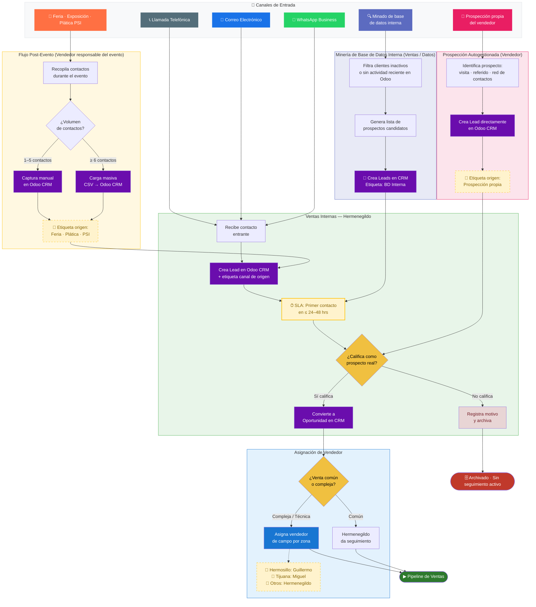

# Flujo de Captación — Prospectos y Clientes Nuevos

> Cubre el camino desde el primer contacto o evento de prospección hasta la apertura de la oportunidad en el pipeline de ventas.

---

## Notas del diagrama

### Canales activos
| Canal | Responsable de captura | Herramienta |
|---|---|---|
| WhatsApp Business | Hermenegildo | Odoo CRM (manual o integración) |
| Correo electrónico | Hermenegildo | Odoo CRM (alias de correo) |
| Llamada telefónica | Hermenegildo | Odoo CRM (actividad manual) |
| Feria / Exposición / Plática PSI | Vendedor asistente | CSV post-evento → Odoo CRM |
| Prospección propia del vendedor | Vendedor (autogestionado) | Captura directa en Odoo CRM |
| Minado de base de datos interna | Ventas / Administración | Filtrado en Odoo Contactos → creación de Leads con etiqueta «BD Interna» |

### Regla de carga post-evento
- **≥ 6 contactos:** carga masiva por CSV para agilizar el ingreso.
- **1–5 contactos:** captura manual directamente en Odoo CRM.
- En ambos casos se etiqueta la fuente del evento para trazabilidad y métricas de prospección.

### SLA de primer contacto
> Pendiente de aprobación formal en Sesión 4 (punto 4c).
> Propuesta inicial: primer contacto en ≤ 24–48 hrs desde la creación del lead.
