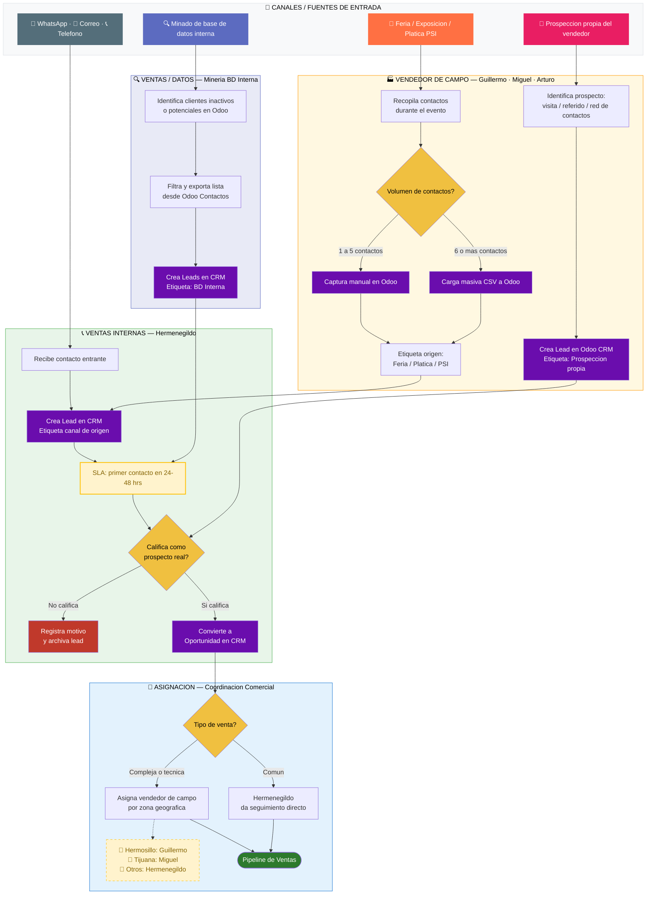

# Swimlane — Proceso Outbound (Captación de Prospectos)

> Mermaid no soporta swimlanes nativos. Este diagrama aproxima el formato usando subgráficos coloreados por actor (carril).
> Para la lógica de decisión completa ver [`flujo-Outbound.md`](./flujo-Outbound.md).

---

