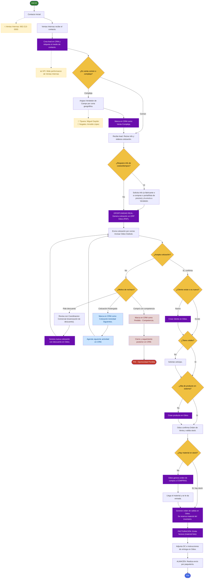

# Flujo de Compra / Atención al Cliente

```mermaid
flowchart TD
    A([INICIO]) --> B["Contacto Inicial"]
    B -.-> NOTE_B["📞 Ventas Internas: 662-213-0303"]
    B --> D["Ventas Internas recibe el contacto."]
    D --> D2["Crea lead en CRM y etiqueta el medio de contacto."]

    D2 -.-> KPI1["📊 KPI: Mide performance de Ventas Internas"]
    D2 --> D3{"¿Es venta común o compleja?"}
    D3 -->|"Común"| G["Recibe lead. Reúne info y elabora cotización."]
    D3 -->|"Compleja"| D4["Asigna Vendedor de Campo por zona geográfica."]
    D4 -.-> NOTE_D4["📍 Tijuana: Miguel Gaytán\n📍 Nogales: Arnoldo López"]
    D4 --> D5["Marca en CRM como Venta Compleja."]
    D5 --> G

    G --> H{"¿Requiere info de costos/tiempos?"}

    H -->|Sí| I["Solicita info (a fabricante o a compras o portal/lista de precios) y la envía a Vendedor."]
    I --> J["OPORTUNIDAD REAL: Genera cotización en ERP Odoo (PDF)."]
    H -->|No| J
    J --> K["Envía cotización por correo /revisar Odoo Outlook."]

    K --> L{"¿Acepta cotización?"}

    L -->|"No"| L2{"¿Motivo de rechazo?"}
    L2 -->|"Pide descuento"| M["Revisa con Coordinacion Comercial (Autorización de descuento)."]
    M --> M2["Genera nueva cotización con descuento en Odoo."]
    M2 --> K
    L2 -->|"Cotización Postergada"| L3["Marca en CRM como Cotización Actividad Siguientes."]
    L2 -->|"Compró con competencia"| L4["Marca en CRM como Perdido - Competencia."]
    L3 --> ACT1["Agenda siguiente actividad en CRM."]
    ACT1 --> K
    L4 --> L5["Cierre y seguimiento posterior en CRM."]
    L5 --> WLOST([FIN - Oportunidad Perdida])
    L -->|"Sí, confirma"| CLT{"¿Cliente existe o es nuevo?"}
    CLT -->|"Existe"| CR{"¿Tiene crédito?"}
    CLT -->|"Nuevo"| CLT2["Crear cliente en Odoo."]
    CLT2 --> CR
    CR -->|"Sí"| ALT{"¿Alta de producto en sistema?"}
    CR -->|"No"| ANT["Solicitar anticipo."]
    ANT --> ALT
    ALT -->|"Sí"| P["Odoo confirma Orden de Venta y valida stock."]
    ALT -->|"No"| PROD["Crear producto en Odoo."]
    PROD --> P

    P --> Q{"¿Hay material en stock?"}
    Q -->|No| O["Odoo genera orden de compra a COMPRAS."]
    Q -->|"Sí, hay stock"| SAL
    O --> MAT["Llega el material y se le da entrada."]
    MAT --> SAL["Generar orden de salida en Odoo.\nSe reserva material del inventario."]

    SAL --> T["FACTURACIÓN: Emite factura (material listo)."]
    T --> U["Adjunta OC e instrucciones de entrega en Odoo."]
    U --> V["ALMACÉN: Realiza envío por paquetería."]
    V --> W([FIN])

    style A fill:#2d7a2d,color:#fff
    style W fill:#4169e1,color:#fff
    style D2 fill:#6a0dad,color:#fff
    style NOTE_B fill:#fff3cd,color:#856404,stroke:#ffc107,stroke-dasharray:5 5
    style NOTE_D4 fill:#fff3cd,color:#856404,stroke:#ffc107,stroke-dasharray:5 5
    style KPI1 fill:#fff3cd,color:#856404,stroke:#ffc107,stroke-dasharray:5 5
    style H fill:#f0c040,color:#000
    style L fill:#f0c040,color:#000
    style L2 fill:#f0c040,color:#000
    style L3 fill:#cce5ff,color:#004085
    style ACT1 fill:#cce5ff,color:#004085
    style L4 fill:#e8d5d5,color:#721c24
    style L5 fill:#e8d5d5,color:#721c24
    style WLOST fill:#c0392b,color:#fff
    style M2 fill:#6a0dad,color:#fff
    style Q fill:#f0c040,color:#000
    style CLT fill:#f0c040,color:#000
    style CLT2 fill:#6a0dad,color:#fff
    style CR fill:#f0c040,color:#000
    style ALT fill:#f0c040,color:#000
    style D3 fill:#f0c040,color:#000
    style D5 fill:#6a0dad,color:#fff
    style J fill:#6a0dad,color:#fff
    style O fill:#6a0dad,color:#fff
    style PROD fill:#6a0dad,color:#fff
    style SAL fill:#6a0dad,color:#fff
    style T fill:#6a0dad,color:#fff
```
