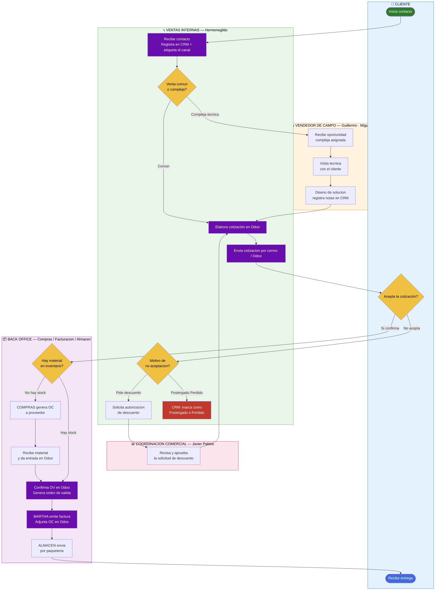

# Swimlane — Proceso Inbound (Flujo de Compra / Atención al Cliente)

> Mermaid no soporta swimlanes nativos. Este diagrama aproxima el formato usando subgráficos coloreados por actor (carril).
> Para la lógica de decisión completa ver [`flujo-Indbound.md`](./flujo-Indbound.md).

---

